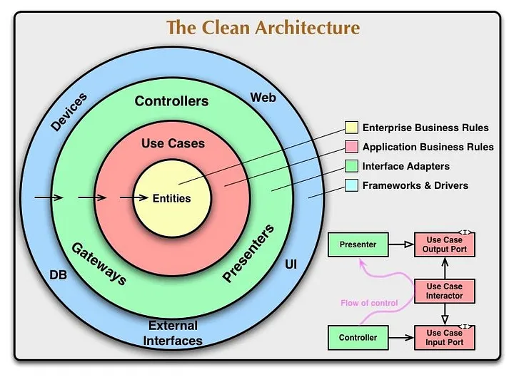
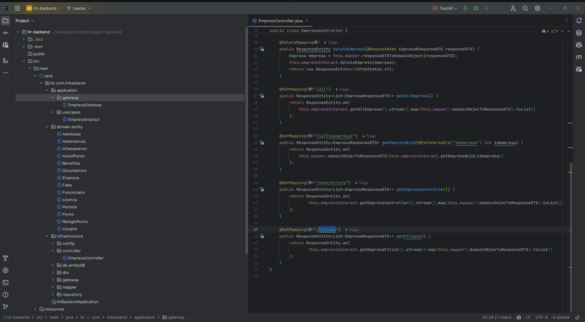

# Backend para sistema RH
Sistema desenvolvido para gestão de pessoas de pequenas e grandes empresas

<h1 align="center">
    
    
</h1>

## 🚀 Motivaçao / objetivo

Em 2015 aproximadamente eu havia desenvolvido esse sistema para um empresa local usando java + angular (angular 1 e terminei no 2). A idéia é refatorar todo o sistema usando clean-archtecture e solid.


## 💻 Requisitos

No projeto foi utilizado o spring boot e a plataforma intelij idea. Você pode utilizar qualquer plataforma de desenvolvimento, exemplo: eclipse e o Netbeans.

## 🚀 Instalando

Primeiro, você deve clonar o projeto na sua máquina, para isso você
pode colar o seguinte comando em seu terminal

```bash
git clone https://github.com/Tiago-Silva/Hr-BackEnd-clean-architecture-solid.git
```

Para instalar as dependências, realize o reload com o Maven, se você preferir pode executar o camando via terminal:

```bash
mvn clean install
```

## Tecnologias utilizadas

<!-- Ícones de tecnologias. Você pode encontrar esses ícones em sites como https://simpleicons.org/ -->
<p align="center">
  <a href="https://skillicons.dev">
    
  </a>
</p>


## 📝 Licença

Este projeto está licenciado sob a licença MIT. Consulte o arquivo `LICENSE` para obter mais informações.

